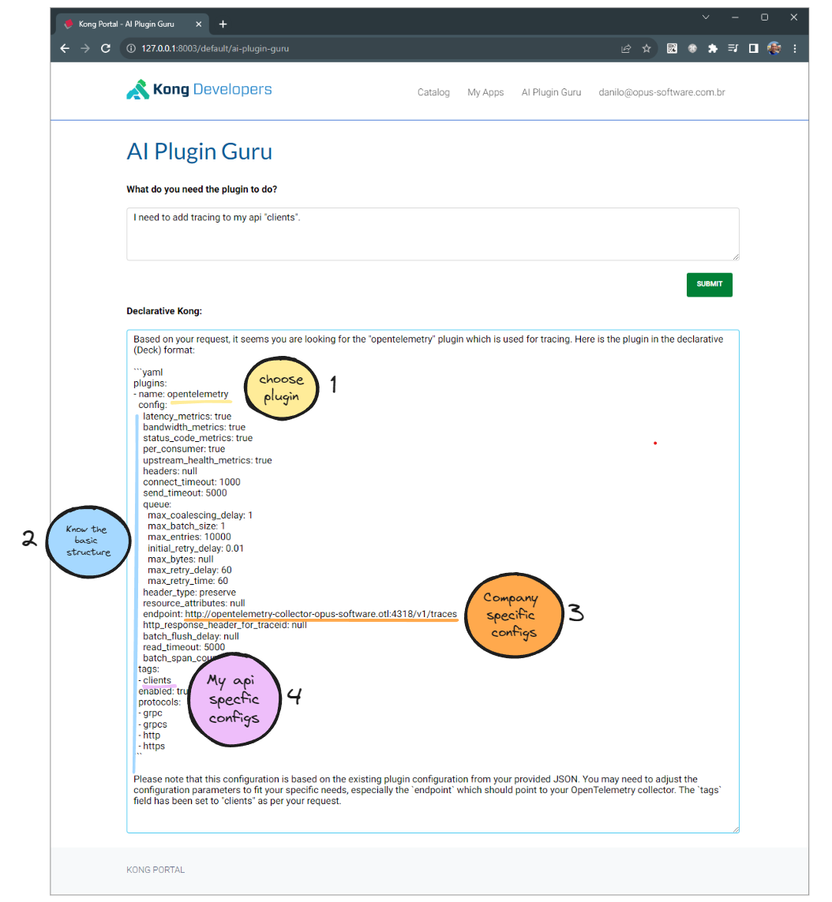

# kong-ai-plugin-guru




```
plugins:
- name: opentelemetry
instance_name: example-opentemetry
config:
    endpoint: "http://opentelemetry-collector-opus-software.otl:4318/v1/traces"
```


1. Get a developer key from the Developer API.

2. Get the json list of plugins already installed.

3. Get the response from ChatGPT.


Install Kong:
```
helm --namespace kong install kong kong/kong  --values ./kong/embedded.yaml --create-namespace
```

Add the services, routes and plugins:
```
deck sync --workspace default --select-tag ai-plugin-guru --state ./deck/ai-plugin-guru.yaml
```

Add examples plugins:
```
deck sync --workspace default --select-tag example-plugins --state ./deck/example-plugins.yaml
```

Add the Ai Plugin Guru to the Devportal:
```
/portal.conf.yaml: Add the lines in ./developer-portal/portal.conf.yaml
/content: Add the file ./developer-portal/content/ai-plugin-guru.txt
/themes/base/layouts: Add the file ./developer-portal/themes/base/layouts/ai-plugin-guru.html
```