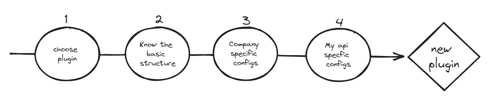

# kong-ai-plugin-guru

To build the image:
```
docker build --tag danilofukuoka/kong-plugin-assistant:0.4 . & docker push danilofukuoka/kong-plugin-assistant:0.4
```

To deploy API:
```
kubectl create deployment kong-plugin-assistant --image=danilofukuoka/kong-plugin-assistant:0.4
kubectl expose deployment kong-plugin-assistant --type=ClusterIP --port=80 --target-port=5000
k port-forward svc/kong-plugin-assistant 8080:80
```

To deploy Developer Portal:
```
cd ~/hackton-summit/kong-portal-templates
portal deploy default
```


