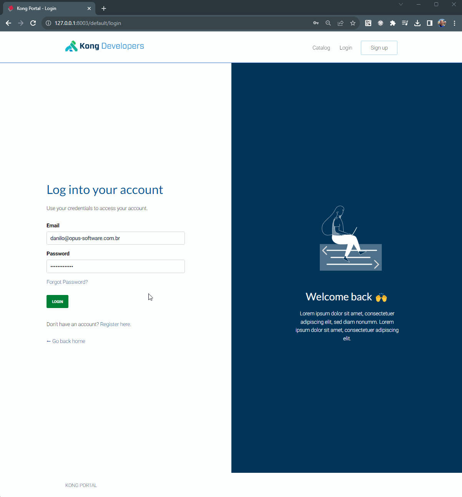
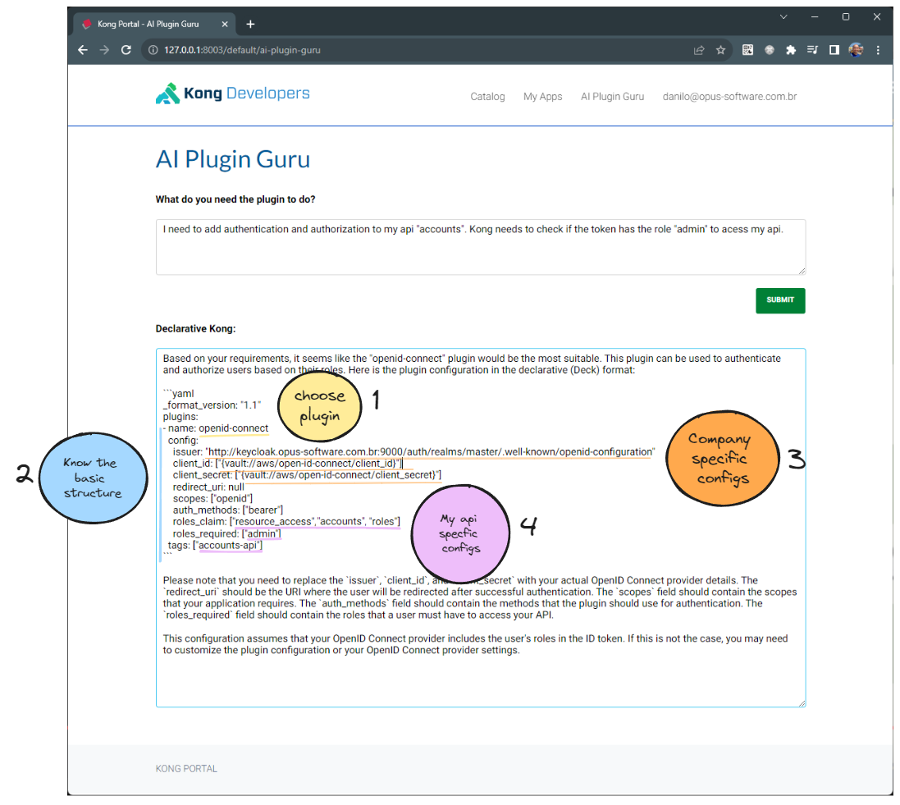
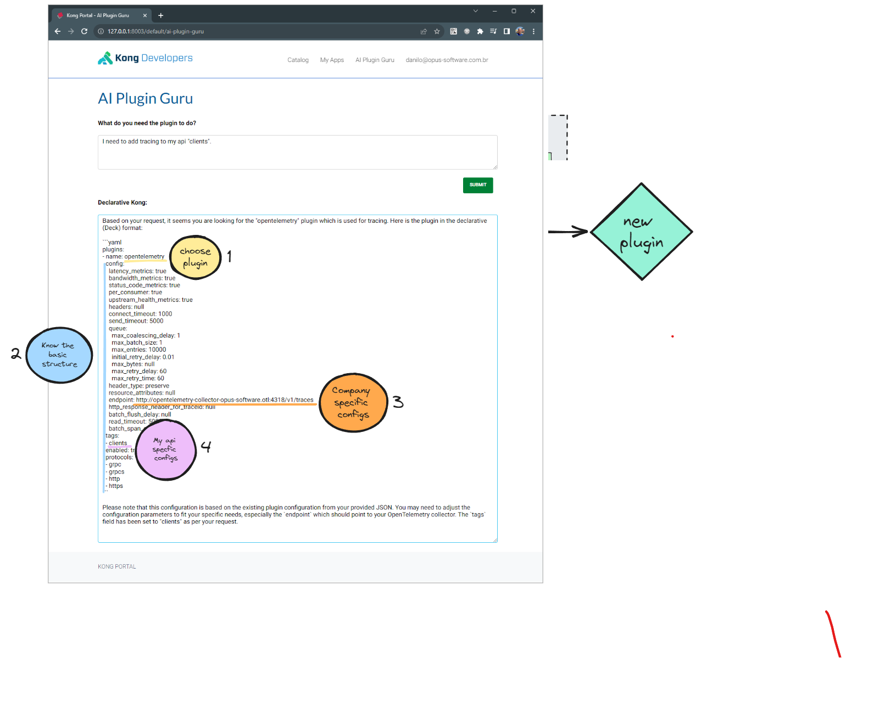

# kong-ai-plugin-guru

## Demo

URL: www.placeholder.com.br



## About

This repository contains an Addon to the Kong Developer Portal that leverages ChatGPT to create Kong plugins. The goal is to help new developers create new plugins more easily and quickly.

## The improvement


### The Normal Way:
A new developer has to go through at least these four steps:

1) **Choose a plugin:** The developer needs to select a plugin that solves its problems. Sometimes, it's not clear which plugin to use because they have different names. For example, OpenID Connect (for authentication and authorization) and OpenTelemetry (for tracing).

2) **Understand the basic structure:** Each plugin has its own basic structure described in its documentation.

3) **Company-Specific Configurations:** Most plugins require company-specific configurations, such as endpoints, client IDs, client secrets, and other settings. The new developer has to review the code of the already installed plugins or seek assistance from others to understand these specifications.

4) **My API-Specific Configurations:** The new developer has to modify the basic use of the plugins to include specific configurations for their own API."

### The AI Plugin Guru Way:

1) **Write what you need:** Write in natural language (any language: english, portugues, spanish...) what you need the plugin to do, and ChatGPT will consult the configurations of the plugins already installed in your company and provide you with the declarative Kong configuration of the plugin you need. And that's it.


## Examples

### User: I need to add authentication and authorization to my api "accounts". Kong needs to check if the token has the role "admin" to acess my api.

For example, the following plugin is already configured, and AI Plugin Guru is going to use this configuration as a base to suggest a new one:

```
plugins:
- name: openid-connect
instance_name: example-openid-connect
enabled: true
config:
    auth_methods:
    - bearer
    introspect_jwt_tokens: false
    verify_signature: false
    client_id: 
    - "{vault://aws/open-id-connect/client_id}"
    client_secret: 
    - "{vault://aws/open-id-connect/client_secret}"
    verify_claims: true
    issuer: http://keycloak.opus-software.com.br:9000/auth/realms/master/.well-known/openid-configuration
    roles_claim:
    - resource_access
    - api-teste
    - roles
    roles_required:
    - admin
```

Plugin created by Ai Plugin Guru:

```
plugins:
- name: openid-connect
  config:
    issuer: "http://keycloak.opus-software.com.br:9000/auth/realms/master/.well-known/openid-configuration"
    client_id: ["{vault://aws/open-id-connect/client_id}"]
    client_secret: ["{vault://aws/open-id-connect/client_secret}"]
    redirect_uri: null
    scopes: ["openid"]
    auth_methods: ["bearer"]
    roles_claim: ["resource_access", "accounts", "roles"]
    roles_required: ["admin"]
  tags: ["accounts-api"]
```





### User: I need to add tracing to my api "clients".

For example, the following plugin is already configured, and AI Plugin Guru is going to use this configuration as a base to suggest a new one:
```
plugins:
- name: opentelemetry
instance_name: example-opentemetry
config:
    endpoint: "http://opentelemetry-collector-opus-software.otl:4318/v1/traces"
```
Plugin created by Ai Plugin Guru:

```
plugins:
- name: opentelemetry
  config:
    header_type: preserve
    http_response_header_for_traceid: null
    batch_span_count: null
    send_timeout: 5000
    read_timeout: 5000
    headers: null
    resource_attributes: null
    endpoint: http://opentelemetry-collector-opus-software.otl:4318/v1/traces
    batch_flush_delay: null
    queue:
      max_bytes: null
      max_retry_delay: 60
      initial_retry_delay: 0.01
      max_batch_size: 1
      max_entries: 10000
      max_coalescing_delay: 1
      max_retry_time: 60
    connect_timeout: 1000
  tags:
  - clients
  enabled: true
```




## How it works

First, the Kong AI Plugin Guru, a JavaScript file within the Developer Portal, retrieves a list of configured plugins from the Kong Admin API (/plugins). This endpoint returns a list of installed plugins in JSON format.

Afterward, the prompt that will be sent to ChatGPT is constructed as follows:

```
    Hello. Can you provide a Kong plugin in the declarative Kong format (Deck)?
    I will specify the type of plugin I need.
    You will search for this plugin in the following JSON list: '${pluginsJson}'.
    If you find the plugin that matches my criteria closely, transform it into the Deck format. 
    Remove information about routes and services, and provide me with the complete code.
    Do not provide a general example. Do not ask to replace fields that were found in the JSON list.
    If I provide specific information about my API, please use it to add custom tags.

    If you do not find the plugin, please inform me that there is no pre-configured plugin of this kind. 
    Then, search in your database for how to use the plugin that is most likely to solve my problem.
```

The user's input, describing their specific needs, is concatenated at the end of the prompt and sent to ChatGPT.

```
const requestData = {
    model: "gpt-4",
    messages: [{ role: "user", content: prompt + userInput }],
    temperature: 0,
};
```

## Flow


In order to securely manage tokens for the Kong Admin API and ChatGPT, a process was implemented to store these tokens in AWS Secret Manager. To prevent exposing these tokens in JavaScript, they are injected into the headers when a request passes through the Kong Plugin.

To secure these routes (Kong Admin API and ChatGPT), an authentication key has been created. To simplify the process for developers, the Kong AI Plugin Guru obtains a developer key from the Kong Developer Portal API for authentication against the authentication key system. The following steps outline this process:

### 1. Get a developer key from the Developer Portal API.
Since the developer already has an active session with the Kong Developer Portal, it is possible to call the 'developer keys' endpoint (/credentials/key-auth?size=1) to retrieve a developer key.

### 2. Get the json list of plugins already installed.
With this key, AI Plugin Guru can call the '/plugins' endpoint of the Kong Admin API to retrieve the list of already installed plugins. The Advanced Request Transformer will add the Kong Admin Token to the header. Due to the integration with AWS Secret Manager, this plugin must be of the 'advanced' type. The Cors plugin is used to only accept calls from the Developer Portal.

### 3. Get the response from ChatGPT.
The same process applies to calling ChatGPT.


## Build

**Install Kong**:
```
helm --namespace kong install kong kong/kong  --values ./kong/embedded.yaml --create-namespace
```

To enable integration with AWS Secret Manager, please populate the values of these Environment Variables in the embedded.yaml file:
```
customEnv:
  AWS_ACCESS_KEY_ID:
  AWS_REGION:
  AWS_SECRET_ACCESS_KEY:
  AWS_SESSION_TOKEN:
```

And create a secret with 2 keys: chatgpt and kong-admin.

**Add the services, routes and plugins**:
```
deck sync --workspace default --select-tag ai-plugin-guru --state ./deck/ai-plugin-guru.yaml
```

**Add examples plugins**:
```
deck sync --workspace default --select-tag example-plugins --state ./deck/example-plugins.yaml
```

**Add the Ai Plugin Guru to the Devportal**:
```
/portal.conf.yaml: Add the lines to ./developer-portal/portal.conf.yaml
/content: Add the file ./developer-portal/content/ai-plugin-guru.txt
/themes/base/layouts: Add the file ./developer-portal/themes/base/layouts/ai-plugin-guru.html
```