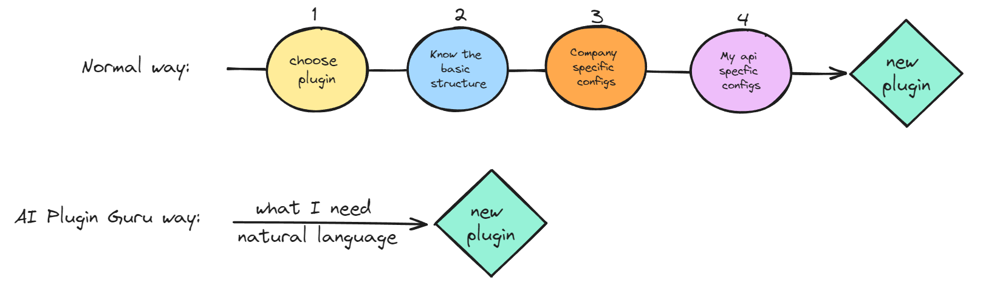

# kong-ai-plugin-guru

## Demo

URL: www.placeholder.com.br

## About

This repository contains an Addon to the Kong Developer Portal that leverages ChatGPT to create Kong plugins. The goal is to help new developers create new plugins more easily and quickly.

## The improvement



### The Normal Way: 
A new developer has to go thoutl at least to these 4 step:
1) Choose a plugin. The developer have a problem and have to search for a plugin that solves this problem. Sometimes it is not clear wich plugin to use, because it has diferent name. For example, Open Id Connect (for authentication and authorization) and Opentelemetry (for tracing.)
2) Know the basic sctructure. Wich plugin has their own basic structure described in it documentation.
3) Company Specific Configs. The most part of plugins requires company specific configurations, like endpoints, clients ids, client secrets and other configurations. The new developer have to consult the code of the plugins already installed or ask help to other person to know this specifications.
4) The new developer have to alter the basic use of the plugins to include specific configurations of his own API. 

### The Normal Way:
A new developer has to go through at least these four steps:

1) Choose a plugin. The developer has a problem and needs to search for a plugin that solves this problem. Sometimes, it's not clear which plugin to use because they have different names. For example, OpenID Connect (for authentication and authorization) and OpenTelemetry (for tracing).

2) Understand the basic structure. Each plugin has its own basic structure described in its documentation.

3) Company-Specific Configurations. Most plugins require company-specific configurations, such as endpoints, client IDs, client secrets, and other settings. The new developer has to review the code of the already installed plugins or seek assistance from others to understand these specifications.

4) The new developer has to modify the basic use of the plugins to include specific configurations for their own API."

## Examples


```
plugins:
- name: opentelemetry
instance_name: example-opentemetry
config:
    endpoint: "http://opentelemetry-collector-opus-software.otl:4318/v1/traces"
```


```
  - name: openid-connect
    instance_name: example-openid-connect
    enabled: true
    config:
        auth_methods:
        - bearer
        introspect_jwt_tokens: false
        verify_signature: false
        client_id: 
        - "{vault://aws/open-id-connect/client_id}"
        client_secret: 
        - "{vault://aws/open-id-connect/client_secret}"
        verify_claims: true
        issuer: http://keycloak.opus-software.com.br:9000/auth/realms/master/.well-known/openid-configuration
        roles_claim:
        - resource_access
        - api-teste
        - roles
        roles_required:
        - admin
```


1. Get a developer key from the Developer API.

2. Get the json list of plugins already installed.

3. Get the response from ChatGPT.


Install Kong:
```
helm --namespace kong install kong kong/kong  --values ./kong/embedded.yaml --create-namespace
```

Add the services, routes and plugins:
```
deck sync --workspace default --select-tag ai-plugin-guru --state ./deck/ai-plugin-guru.yaml
```

Add examples plugins:
```
deck sync --workspace default --select-tag example-plugins --state ./deck/example-plugins.yaml
```

Add the Ai Plugin Guru to the Devportal:
```
/portal.conf.yaml: Add the lines in ./developer-portal/portal.conf.yaml
/content: Add the file ./developer-portal/content/ai-plugin-guru.txt
/themes/base/layouts: Add the file ./developer-portal/themes/base/layouts/ai-plugin-guru.html
```